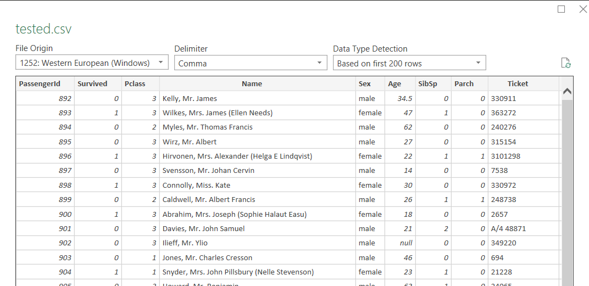
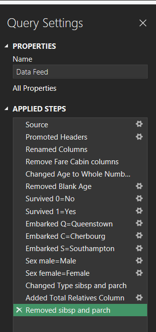
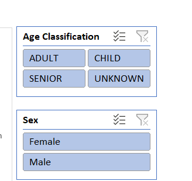

# TitanicExcel

##Data Location
Dataset was retrieved from Kaggle at the link below
https://www.kaggle.com/datasets/pavlofesenko/titanic-extended

##PowerQuery
Read in datafile from data folder so if original sheet is updated at any point workbook will update automatically

The following edits were made in powerquery:
1. Made age a whole number, changed null to 0
2. Removed columns fare and cabin
3. Replaced values in survived (0=no,1=yes)
4. Replaced values in Embarked (c=Cherbourg, q=Queenstown, s=Southampton)
5. Replaced value in sex (male=Male,female=Female) used match entire cell contents to prevent FeMale edits
6. Changed data type sibsp and parch for creation of custom column 'Total Relatives'; removed sibsp and parch
7. Made passenger ID whole number

After data was imported added additional column detailing age ranges via IF(AND) formulas

##Dashboard
Created via 'helper sheet' with pivottables on hidden sheet titled 'Dashboard Feed'
Created slicers for age classification and sex, slicers are linked to all pivot tables and graphs

##Passenger Dashboard
Created random passenger button and linked to a macro so a random passenger ID would populate and generate facts about the passenger via INDEX(MATCH) and IFERROR formulas

##Protected!
Data sheets were then protected via password so the integrity of the data and dashboard would be intact